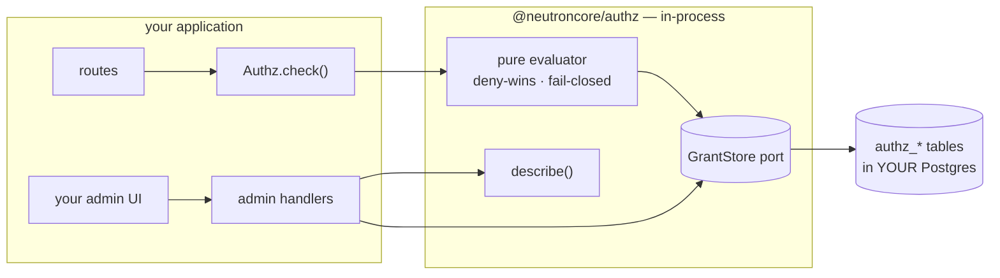

# @neutroncore/authz

Embeddable TypeScript authorization engine: policy statements + grants-at-scope + typed ABAC
conditions, deny-wins, asymmetric fail-closed. **Policies are rows in your own Postgres**, authored
at runtime — by an admin UI, or by an agent — not files compiled into a deployment.

**Documentation: <https://developerinlondon.github.io/neutron-authz/>**

```sh
npm install @neutroncore/authz        # or: bun add / pnpm add / yarn add
npm install @neutroncore/authz kysely # kysely only for the shipped Postgres backend
```

Compiled ESM with type declarations — plain Node ≥ 20, no bundler. Zero runtime dependencies.

## Sixty seconds

```ts
import { PgAuthzStore } from "@neutroncore/authz/backends/pg";
import { makeAuthz } from "@neutroncore/authz/core";
import { actionRegistryFromCatalogue } from "@neutroncore/authz/ports";

const store = new PgAuthzStore(db, {
  scopeKinds: ["root", "project"],
  rootScope: { kind: "root", id: "*" },
});

const authz = makeAuthz({
  grantStore: store,
  auditSink: store,
  actionRegistry: actionRegistryFromCatalogue([
    { action: "docs.read" },
    { action: "docs.write", derivesFrom: "docs.read" }, // naming docs.read covers both — allow AND deny
  ]),
  conditionKeys: { "app:Region": { type: "string" } },
  defaultScopeChain: [{ kind: "root", id: "*" }],
});

await authz.check([{ kind: "user", id: "alice" }], "docs.write", "doc:42");
// deny-wins over every grant in the scope chain; audited; nothing granted ⇒ false
```

## The admin surface is data, and the UI writes itself

The engine serves its whole vocabulary as a stable JSON document (`describe()`), plus framework-free
`(Request) => Response` admin routes over it. Every screen below is generated from that document —
declare a new condition key server-side and a new form field appears with **no frontend change**:

[](example/)

That page is [`example/ui.html`](example/) — one static file, no framework, no host knowledge. Run
it: `cd example && bun install && bun run server.ts`.

## Architecture



The engine is a pure core behind ports. The shipped Postgres backend is the reference implementation
— **any storage that passes the
[conformance fixtures](https://developerinlondon.github.io/neutron-authz/docs/storage-and-conformance/)
is decision-identical and drops in behind the same seam**, with zero call-site churn. The host keeps
authentication, subject resolution, HTTP routing, the vocabulary, and what the admin UI looks like.

## How it compares

|                                               | @neutroncore/authz                                                           | Cedar                      | OpenFGA / SpiceDB                             | Casbin                     |
| --------------------------------------------- | ---------------------------------------------------------------------------- | -------------------------- | --------------------------------------------- | -------------------------- |
| Runs as                                       | in-process library                                                           | in-process (WASM from JS)  | **separate stateful service**                 | in-process library         |
| Policy shape                                  | typed statements + typed ABAC conditions                                     | Cedar policy language      | relationship tuples (+ CEL caveats)           | matcher expression strings |
| Policies authored at runtime by admins/agents | first-class: schema-validated rows, named errors                             | possible; storage is yours | tuples via API; model changes are code-shaped | reload from adapters       |
| Storage                                       | **shipped**: Postgres + migrations + at-rest checks; swappable behind a port | bring your own             | the service's own store                       | thin adapters              |
| A deny whose condition can't evaluate         | **deny stands** (fail closed)                                                | erroring policy is skipped | n/a (graph model)                             | depends on the matcher     |
| Per-decision audit trail                      | built in                                                                     | bring your own             | varies                                        | bring your own             |
| Admin surface                                 | vocabulary served as data + HTTP handlers                                    | bring your own             | service APIs                                  | bring your own             |
| Reverse queries ("who can see X"), at scale   | no — checks only                                                             | no                         | **yes — their home turf**                     | limited                    |
| Formally verified evaluator                   | no                                                                           | **yes**                    | no                                            | no                         |

Two of those rows are the reason this library exists. When policies are **data written by admins and
agents**, you need storage, migrations, write-time validation with errors a UI can show, an audit
trail, and an admin surface — and with an evaluator-only library you build all five yourself. And
when a deny's condition cannot be evaluated, this engine keeps the deny standing; an engine that
skips an erroring policy fails **open** exactly where the author asked it to fail closed.

Reach for the others where their strengths are real: **Cedar** if you want the formally verified
evaluator and analysis tooling and are happy building the storage/audit/admin ring around it;
**OpenFGA/SpiceDB** if your questions are graph-shaped over millions of relationships — reverse
indexing at scale is genuinely their product, and this library does not do it.

## Concepts in one line each

| Concept           | In short                                                                                       | Docs                                                                                                     |
| ----------------- | ---------------------------------------------------------------------------------------------- | -------------------------------------------------------------------------------------------------------- |
| Statements        | `{effect, actions, resources, conditions?}` — actions from a closed registry, never wildcarded | [Semantics](https://developerinlondon.github.io/neutron-authz/docs/semantics/)                           |
| Scope chains      | host-resolved, root-first; deny anywhere beats allow anywhere; malformed ⇒ deny                | [Semantics](https://developerinlondon.github.io/neutron-authz/docs/semantics/)                           |
| Conditions        | typed operator whitelist, tri-state, asymmetric fail-closed — no expression language           | [Conditions](https://developerinlondon.github.io/neutron-authz/docs/conditions/)                         |
| Action derivation | a statement naming a parent covers its declared, enumerable family — allow and deny alike      | [Semantics](https://developerinlondon.github.io/neutron-authz/docs/semantics/)                           |
| Grant bounds      | conditions on the grant: one curated policy, different limits per subject; narrows allow only  | [Grants & bounds](https://developerinlondon.github.io/neutron-authz/docs/grants-and-bounds/)             |
| Role synthesis    | app-owned role rows become grants at check time — one storage, no dual-write                   | [Architecture](https://developerinlondon.github.io/neutron-authz/docs/architecture/)                     |
| Descriptor        | the vocabulary as versioned JSON; any UI on any runtime renders from it                        | [Admin surface](https://developerinlondon.github.io/neutron-authz/docs/admin-surface/)                   |
| Conformance       | golden fixtures any alternative backend must decide identically — the swap-proof               | [Storage & conformance](https://developerinlondon.github.io/neutron-authz/docs/storage-and-conformance/) |

## Development

```sh
bun install
bun test                # pg suite needs DATABASE_URL (scratch db created/dropped)
bunx tsc --noEmit
```

Installing straight from git also works (`bun add github:developerinlondon/neutron-authz#v0.4.1`) —
`dist/` is committed and CI refuses a stale one.

## Releasing

Bump `version` in `package.json`, merge, push the matching tag
(`git tag v0.4.1 && git push origin v0.4.1`). The release workflow typechecks, runs the whole suite
including the storage-backed conformance runner against Postgres, refuses a tag that disagrees with
`package.json`, and publishes via npm trusted publishing — no token exists anywhere.

## License

Apache-2.0
