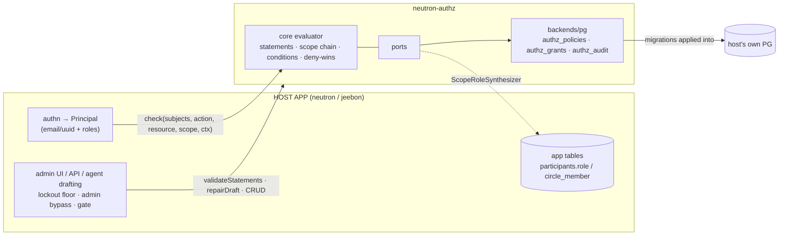
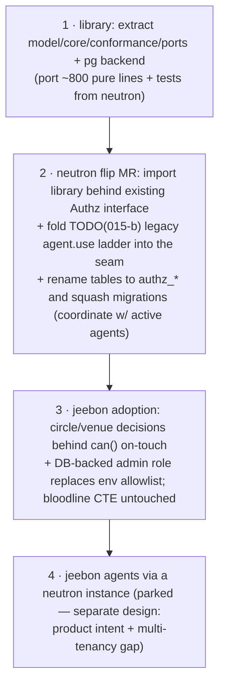

# neutron-authz — embeddable TypeScript authorization engine

**Version**: 1.0 · **Status**: Approved 2026-07-15 · **First clients**: neutron core, jeebon

Extraction of neutron core's proven authz seam (`apps/api/src/authz/`, plans
[015](https://gitlab.com/bizfoundry/core/neutron/-/tree/main/plans/015-agent-admin-governance) /
[019](https://gitlab.com/bizfoundry/core/neutron/-/tree/main/plans/019-authz-hierarchy-abac)) into a
standalone library: AWS-shape policy statements + GCP-shape grants-at-scope + typed ABAC conditions,
deny-wins, asymmetric fail-closed.

## Architecture



```text
neutron-authz/
├── model/        statement, grant, condition, subject shapes — THE SPEC
├── core/         pure evaluator (zero deps, no I/O)
├── conformance/  golden fixtures: every semantic as data-driven tests
├── ports/        GrantStore · AuditSink · ScopeRoleSynthesizer ·
│                 ActionRegistry · ConditionKeys · SubjectDirectory (optional)
└── backends/
    ├── pg/       reference Kysely adapter + migrations (authz_* tables)
    └── assay/    LATER — HTTP client impl of the same Authz seam
```

## The model (unchanged from neutron plans 015/019)

- **Statement**:
  `{effect: allow|deny, actions: [closed enum], resources: ["kind:id" | single
  trailing *], conditions?: [{operator, key, value}]}`
  — jsonb, no wildcards in actions, no expression language.
- **Grant**: `(subject {kind,id}, policy, scope)` over a host-declared scope hierarchy; evaluation
  unions grants up the scope chain; **deny anywhere beats allow anywhere**.
- **Subjects are explicit `{kind, id}` pairs**; kinds host-declared (neutron:
  `user|role|token|agent`; jeebon: `user|role`). No principal storage in the library — grants hold
  references, a dangling reference never matches. Identity is entirely the host's problem.
- **Conditions**: whitelisted typed operators (String/Numeric/Date/IpAddress) over host-declared +
  built-in keys; pure tri-state matcher (`match`/`no-match`/`unmatchable`); **asymmetric
  fail-closed** — an allow contributes only on definitive match, an unmatchable deny STAYS STANDING.
- **Role synthesis**: app-owned role rows (neutron `participants.role`, jeebon `circle_member.role`)
  become grants at check time via the `ScopeRoleSynthesizer` port — one storage, no dual-write.
- **SoD approvals** (`canApprove`/`inboxVisible`/`resolveApprover`) ship as a separate pure module.

Stays host-side, permanently: authn → Principal resolution, token mint/verify, admin bypass +
lockout floor, HTTP routes, admin UI, tool vocabulary/discovery, graph-reachability visibility
(jeebon's bloodline CTE is a host resource-set resolver, never policy).

## Decisions

| Decision              | Choice                                                                                                                                  |
| --------------------- | --------------------------------------------------------------------------------------------------------------------------------------- |
| Language / toolchain  | TypeScript 7 (Go-native tsc, GA 2026-07-08), Bun runtime, `bun test`                                                                    |
| Distribution          | npm package `@bizfoundry/neutron-authz` via GitLab package registry                                                                     |
| Storage               | Reference PG adapter, prefixed `authz_*` tables, migrations applied into the **host's** DB — never a separate authz DB (jeebon ADR 005) |
| Back-compat           | NONE — neutron renames its live tables to `authz_*` and squashes its migration files in the flip MR (active development, both projects) |
| Evaluation placement  | In-process (plan 015: no sidecar on the request/turn/tool-call path)                                                                    |
| Backend flip contract | The `conformance/` fixture suite; any alternative backend (assay) must be decision-identical before an app flips config                 |

## Prior art (why this isn't wheel-reinvention)

Casbin (free-form expression matchers — the injection surface we deliberately exclude), CASL
(UI-level abilities, no scoped grants/audit), OpenFGA/SpiceDB/Keto/assay-zanzibar (ReBAC — different
paradigm), Oso (OSS deprecated), OPA/Rego (a whole policy language). Closest: **AWS Cedar** —
statements, forbid-overrides-permit, conditions, embeddable Rust+WASM. Rejected today because Cedar
is **skip-on-error**: a forbid whose condition errors is IGNORED (fail-open for denies), vs our
deny-stays-standing; plus text-DSL migration churn for live jsonb policies, UI builder, AI drafting.

**Tripwire**: the day we need free-form condition expressions or a policy language, adopt Cedar — do
not grow one here. Re-evaluate `cedar-policy` (Rust crate) vs a port when the assay milestone
starts, with the deny-semantics caveat on the record.

## Assay milestone (separate, later)

Assay-engine already ships a real Zanzibar/ReBAC engine + biscuit capability tokens, but no
statement/deny-wins/ABAC model. When assay grows a statement engine (Rust, PG-backed, behind its
existing `Authz` trait), it must pass `conformance/` fixtures, then apps flip `backend: assay` with
zero call-site churn. Biscuits then slot in as neutron's deferred "scoped tokens v2". Until then
this library is the only implementation and remains the permanent in-process option.

## Rollout



Tracking: neutron seam-flip issue on the neutron repo; phases 3–4 get issues on their own repos when
reached.
