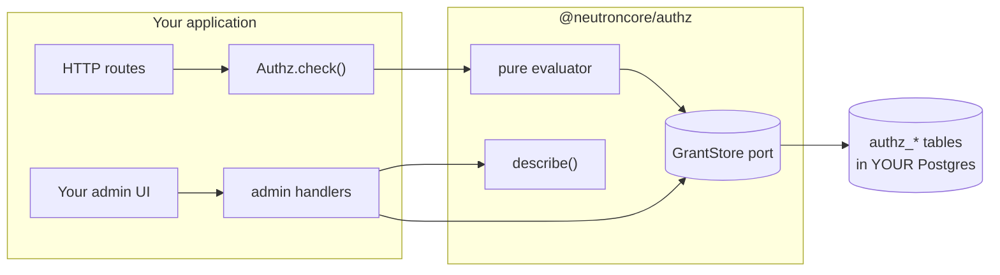

`@neutroncore/authz` is an embeddable TypeScript authorization engine. Policies are **rows in your
own database**, written at runtime through an API or an admin UI, not files compiled into a
deployment.

## Where to start


  
  
  
  
  
  
  
  
  
  


## The shape of it

The host keeps, permanently: authentication and subject resolution, the admin-bypass decision,
HTTP routing, the action vocabulary, and what the admin UI looks like. The library owns the
decision semantics, validation, storage, and audit.
