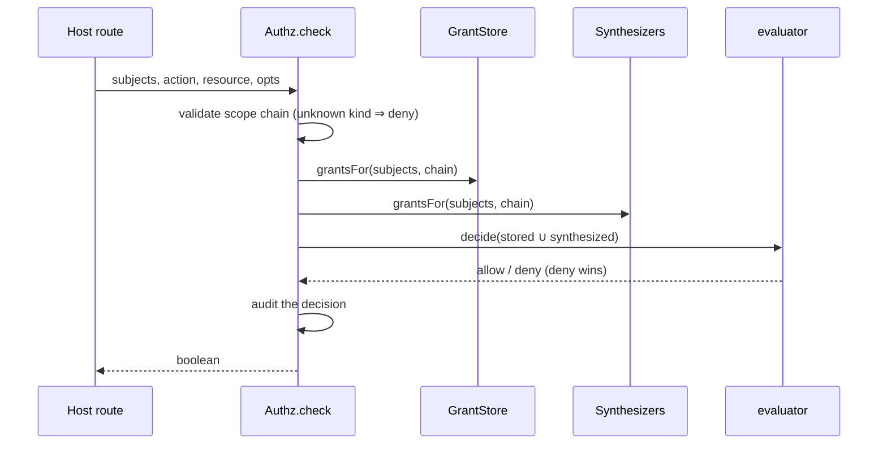

## Why the engine owns storage

Most authorization libraries are evaluators: you hand them policies, they return a decision, and
storage is your problem. That split is right when policies are written by developers and shipped in
git. It is wrong when policies are **data** — written by admins through a UI, or drafted by an agent
— because then you need a schema, migrations, write-time validation, and an audit trail, and you end
up building all four anyway.

This library ships both halves, in-process, against your own database — Postgres as the
reference backend, anything passing the conformance fixtures behind the same port. No sidecar, no network hop,
no cache-invalidation webhook, no fail-open-when-the-PDP-is-down question.

## The layers

| Layer          | Depends on         | Job                                            |
| -------------- | ------------------ | ---------------------------------------------- |
| `model/`       | nothing            | the shapes and their invariants                |
| `core/`        | `model/`           | decide, validate, describe — pure functions    |
| `ports/`       | `model/`           | the interfaces a host or backend plugs into    |
| `backends/pg`  | `ports/` + kysely  | the only shipped storage; the reference        |
| `admin/`       | `core/` + `ports/` | HTTP surface over the store and descriptor     |
| `conformance/` | `core/`            | the contract any alternative backend must pass |

## The enforcement seam

Every "may these subjects do this action on this resource?" question goes through `Authz.check()` —
no call site reads grant storage directly. That is what makes the storage backend swappable with
zero call-site churn: an alternative backend implements `GrantSource`, passes the
[conformance suite](../storage-and-conformance#conformance), and the config flips.

**Role synthesis** deserves a note: app-owned role rows (a membership table, a device link) become
grants _at check time_ via `ScopeRoleSynthesizer` — one storage, no dual-write. A synthesized grant
is confined exactly like a stored one at the same scope, and `checkDetailed()` reports whether the
stored grants alone would allow (so a host can tell "explicitly granted" from "allowed by an ambient
default").

## Two enforcement points, same rules

`validateStatements` rejects a bad document at **save** time with a named error a UI can show
verbatim. The evaluator re-checks shape fail-closed at **decision** time — so a row written by an
older code path, a migration, or a future bug still cannot widen authority silently. The pg backend
adds a third, shape-only CHECK constraint at rest.
