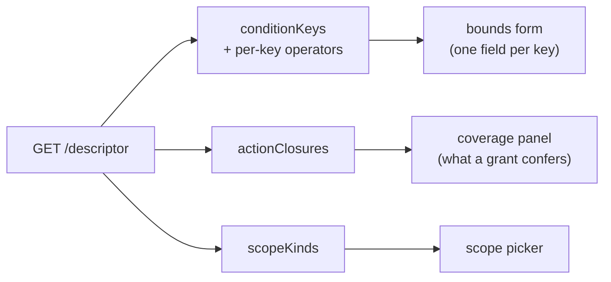

The library deliberately ships **no UI**: two integrations proved that every host wants its own
look, while none of them wants to re-derive the logic. The division of labour that survived: **the
engine supplies what the vocabulary means; the host supplies how it looks.**

This page is the recipe. The [runnable example](../example) implements all of it in one file.

## The generative loop

Everything renders from `GET /descriptor`. Nothing about your host is hard-coded:



## Version gate first

Refuse a descriptor you don't understand rather than render a half-correct form:

```js
const descriptor = await get("/descriptor");
if (descriptor.version !== 1) {
  throw new Error(`this UI understands descriptor v1, server serves v${descriptor.version}`);
}
```

## The bounds form generates itself

One field per **host-declared** condition key, typed by its declaration:

| key declares                     | render                                         |
| -------------------------------- | ---------------------------------------------- |
| `type: "string"`                 | text input                                     |
| `type: "number"`                 | number input                                   |
| `type: "date"`                   | datetime input                                 |
| `type: "ip"`                     | text input with a CIDR placeholder             |
| chosen operator ∈ `setOperators` | switch to a multi-value control, emit `values` |

```js
const authorable = Object.entries(descriptor.conditionKeys)
  .filter(([, spec]) => !spec.builtIn); // request:* keys are engine-populated

function boundControl(spec, operator) {
  if (descriptor.setOperators.includes(operator)) return "multi";
  return { string: "text", number: "number", date: "datetime-local", ip: "text" }[spec.type];
}
```

Two rules the engine holds you to:

- offer **only** the operators the key advertises — they are derived from its type, and
  `POST /grants` rejects anything else with a named error
- a scalar operator emits `value`, a set operator emits `values` — never both

The test that your form is truly generative: **declare a new condition key server-side and a new
field appears with no frontend change.** If it doesn't, something is hard-coded.

## The coverage panel is the feature

"Granted `content-author`" tells a reviewer nothing. Three named actions do. `actionClosures` is
precomputed so this is a lookup, not a graph walk:

```js
function coverage(policy) {
  const granted = new Set(), excluded = new Set();
  for (const s of policy.statements) {
    const into = s.effect === "allow" ? granted : excluded;
    for (const a of s.actions) {
      into.add(a);
      for (const d of descriptor.actionClosures[a] ?? []) into.add(d);
    }
  }
  for (const a of excluded) granted.delete(a);
  return { granted: [...granted].sort(), excluded: [...excluded].sort() };
}
```

Show it **before** the grant is saved — it is the one element that makes a wrong grant visible while
it is still a draft.

## Surface the engine's errors verbatim

A rejected write returns the message `validateConditions` produced:

```js
const res = await post("/grants", draft);
if (!res.ok) showError((await res.json()).error);
// e.g.  condition 0: NumericLessThan cannot test app:Region (a string key)
```

Don't paraphrase it — the engine's wording names the offending condition precisely, and your
paraphrase will drift from what the evaluator actually enforces.

## Keep curation and authoring apart

A statement granting everything is shape-valid, so validation cannot prevent an over-broad policy —
only curation can. The everyday screen assigns a **curated policy** to a subject at a scope and
fills in bounds on the generated form. A free-text statement editor, if you offer one at all,
belongs behind a separate and deliberately inconvenient path.

## Auth is yours

Inject your session into every request (a wrapped `fetch`, a bearer header, a cookie). The handlers
authenticate nothing; the `actor` callback on the server side records who performed each write.
