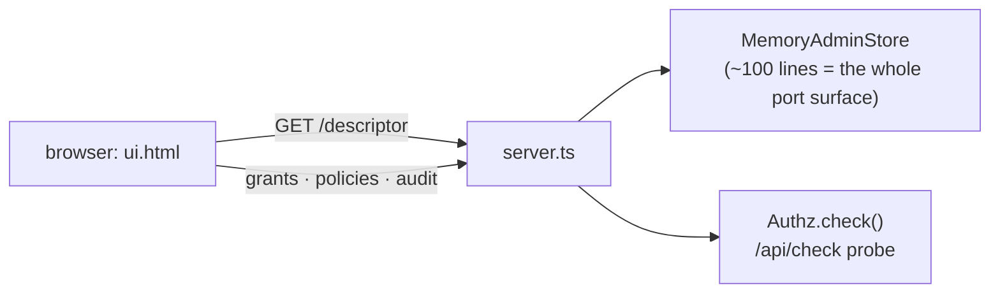

The repository ships a complete host in
[`example/`](https://github.com/developerinlondon/neutron-authz/tree/main/example) — two files,
in memory, nothing to configure:

```sh
cd example
bun install
bun run server.ts     # → http://localhost:8787
```




`server.ts` declares a five-action vocabulary with derivation
(`articles.publish → articles.write → articles.read`), two condition keys, two seeded curated
policies, and mounts the admin handlers plus a `/api/check` probe. The in-memory store is the
instructive part: it implements `AdminStore`, `GrantStore` and `AuditSink` in about a hundred
lines, which is the entire surface a real backend needs — swap it for `PgAuthzStore` and
nothing else changes.

`ui.html` is a complete admin UI in one static file with **no host knowledge**: every control
renders from the descriptor, exactly as [Building a UI](../building-a-ui) describes — the
version gate, the generated bounds form, the coverage panel, set-operator switching, and the
engine's validation messages surfaced verbatim.

## What to try

| Do | See |
|---|---|
| grant *article-author* to `alice` bounded to `app:Region = eu-west`, probe in and out of region | the bound withdraws the allow — but only the allow |
| probe `alice` against `billing.read` | the policy's own deny stands, bounds or not |
| probe `articles.publish` | covered via derivation — the coverage panel named it before you saved |
| submit a bound with a wrong operator | `condition 0: NumericLessThan cannot test app:Region (a string key)` — the engine's words |
| add a condition key in `server.ts`, restart | a new form field appears with **zero** changes to `ui.html` |

That last row is the reuse test the descriptor exists to pass: if adding a key server-side does
not produce a new field with no frontend change, the descriptor is not doing its job.
