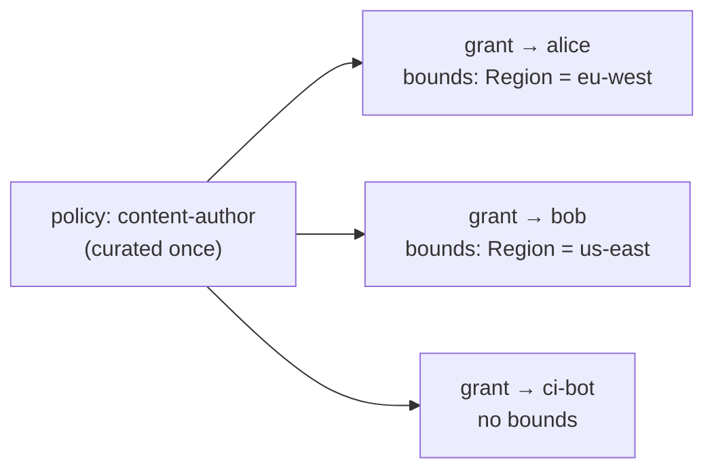

## Grants

A grant attaches a **policy** to a **subject** at a **scope**. Creation is idempotent — re-granting
the same _(policy, subject, scope)_ is a no-op on the grant itself — and revocation by subject
removes the subject's grants at _every_ scope, so a revoked subject cannot keep a deep-scope grant
waiting for a future same-named subject.

```ts
await store.createGrant({
  policyId: policy.id,
  subject: { kind: "agent", id: "deploy-bot" },
  scope: { kind: "project", id: "acme" },
  createdBy: "admin@example.com",
});
```

Machine and human subjects are the same shape on purpose: an automation's access should be as
visible, grantable and revocable as a person's.

## Bounds

A grant may carry `bounds` — conditions attached to the **grant** rather than the policy — so one
curated policy is grantable with different limits per subject, instead of spawning a near-duplicate
policy per variation:

```ts
await store.createGrant({
  policyId: contentAuthor.id,
  subject: { kind: "user", id: "alice" },
  scope: { kind: "project", id: "acme" },
  bounds: [{ operator: "StringEquals", key: "app:Region", value: "eu-west" }],
  createdBy: "admin@example.com",
});
```



Two rules make bounds safe:

 **Bounds narrow ALLOW statements only.** ANDed onto a deny they would
make it fire _less_ often — widening access, the one direction this engine never fails in. A granted
policy's own denials always stand at full strength. 

 **Re-granting replaces bounds.** Granting the same _(policy, subject,
scope)_ again with different bounds overwrites them — and omitting the field clears them — so an
admin tightening a limit is never silently ignored. 

Bounds AND with a statement's own conditions, and an unmatchable bound fails closed exactly like a
statement condition: the allow simply never fires.

## Managed policies

A policy created with `system: true` (only a host seed or migration can do this) is **immutable
through the store** — update and delete throw `SystemPolicyError`, while attaching it and
duplicating it into an editable copy stay open. This is the split between what your product curates
and what your operators author.

Hosts that seed policies from a repository _and_ accept API-created ones should keep the two writers
apart — a restart must not silently revert an API-created row, and an API write must not mutate a
curated one.
